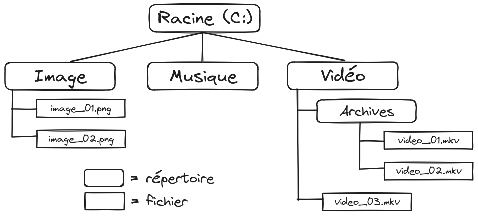

+++
title = "Les fichiers et répertoires"
weight = 12
+++

## Qu'est-ce qu'un fichier ?

Un fichier est une unité de stockage sur un ordinateur. Pensez à un fichier comme à une feuille de papier où vous pouvez écrire des informations. Les fichiers peuvent contenir différents types de données, comme du texte, des images, de la musique, des vidéos, ou des programmes.

## Qu'est-ce qu'un répertoire ?

Un répertoire, aussi appelé dossier, est un conteneur qui peut contenir des fichiers et d'autres répertoires. Imaginez un répertoire comme un classeur où vous pouvez organiser vos feuilles de papier (fichiers) en différentes sections (sous-dossiers).

## Organisation des fichiers et des répertoires

Les fichiers et les répertoires sont organisés dans une structure hiérarchique, souvent comparée à un arbre :

- **Répertoire racine** : Le répertoire principal qui contient tous les autres fichiers et répertoires. Sur Windows, il est souvent appelé `C:\`. Sur macOS et Linux, il est appelé `/`.
- **Sous-répertoires** : Répertoires à l'intérieur d'autres répertoires. Ils permettent d'organiser les fichiers de manière logique. Par exemple, un répertoire `Documents` peut contenir des sous-répertoires pour des `projets`, des `factures`, etc.
- **Chemin d'accès** : La manière dont on désigne l'emplacement d'un fichier ou d'un répertoire. Par exemple, le chemin d'accès à une vidéo peut être `C:\Vidéo\Archives\video_01.mkv` sur Windows.

Dans cet exemple, `Image`, `Musique` et `Vidéo` sont des sous-répertoires de `Racine`.  
Le répertoire `Vidéo` contient un sous-répertoire `Archives` et un fichier `video_03.mkv`.  
Le répertoire `Musique` est vide.  

## Chemins relatif vs absolu

Un **chemin absolu** part toujours de la racine.  
Exemple:
- `C:\Vidéo\Archives\video_01.mkv`

Un **chemin relatif** part d'où nous sommes. Par exemple, si un programme est exécuté dans le répertoire `Vidéo`, son point de départ sera `Vidéo`. Les `..` permettront de remonter au répertoire parent.  
Exemples (à partir de `Vidéo`):
- Pour accéder à `video_01.mkv`: `.\Archives\video_01.mkv`
- Pour accéder à `image_01.png`: `..\Image\image_01.png`

