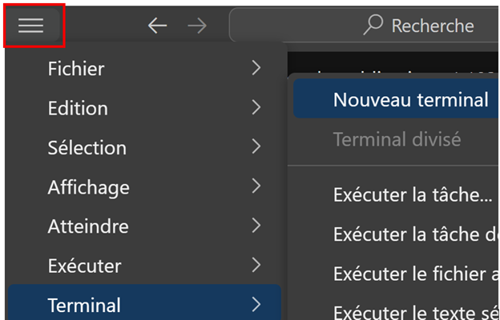

+++
pre = "Installation de l'environnement sur Windows 11"
title = " "
weight = 27
+++

## Prérequis

* Système Windows 11
* Connexion internet active (pour télécharger les composants internes)

## Installation automatisée de l'environnement

1. Téléchargez le fichier [setup_env.exe](./setup_env.exe)
> Il se trouvera dans le dossier **Téléchargements**.
2. Faites un clic-droit dessus, puis choisissez **Exécuter en tant qu'administrateur**.

3. Lorsque la phrase "**Installation silencieuse de Python**" s'affiche, cela indique que Python attend que vous confirmiez vouloir poursuivre l'installation de Python. 
```powershell
== Installation de Python 3.13.5 et outils associés ==
Téléchargement de python_installer.exe depuis https://www.python.org/ftp/python/3.13.5/python-3.13.5-amd64.exe
[========================================] 100.0% (28844032/28838672 bytes)
Téléchargement terminé.

Installation silencieuse de Python
```
> Ouvrez la fenêtre d'installation de Python (si elle ne l'est pas déjà) et cliquez sur **Oui**.


4. Laissez aller l'installation, jusqu'à la fermeture de la fenêtre.
5. Créer un fichier .ipynb et testez le fonctionnement du code suivant:

```python
import pandas as pd
import numpy as np
import matplotlib.pyplot as plt

x = [10,20,30,40,50]
y = [2.5,4.5,6.5,8.5,4.5]

plt.plot(x,y)
plt.title("Graphique test")
plt.show()
```

> Si le graphique s'affiche, tout est beau! Vous êtes prêts à utiliser l'environnement.

<!--

## Guide d’installation étape par étape

Ce guide est conçu pour faciliter l’installation complète de l’environnement de programmation Python et de l’interface de développement.
Bon courage et bonne programmation !


## **Étape 1** : Installer Python 3.13.5

1. Téléchargez ou récupérez le fichier **[python_installer.exe](./python_installer.exe)**
2. Faites un clic droit dessus puis choisissez **« Exécuter en tant qu’administrateur »**.

3. à l'étape des **Options avancées**, cochez la case **« Add Python to environment variables »**. Cliquez sur ***Install***

3. Laissez l’installateur fonctionner jusqu’à la fin.
4. Redémarrez l'ordinateur pour confirmer l'installation.
4. Une fois redémarré, ouvrez une nouvelle fenêtre **Invite de commandes** (tapez `cmd` dans le menu **Démarrer**).

5. Tapez la commande suivante pour vérifier l’installation :

   ```bash
   python --version
   ```

   Vous devriez voir s’afficher :

   ```
   Python 3.13.5
   ```
6. Si tout est correct, passez à l’étape suivante.


## **Étape 2** : Installer Visual Studio Code, Jupyter Notebook et les bibliothèques scientifiques

1. Téléchargez ou récupérez le fichier **[vscode_jupyter_libs_installer.exe](./vscode_jupyter_libs_installer.exe)**.
2. Faites un clic droit dessus puis choisissez **« Exécuter en tant qu’administrateur »**.
3. Laissez le programme s’exécuter jusqu’à ce que le message de fin apparaisse.
4. Cette étape installe :

   * Visual Studio Code
   * Jupyter Notebook
   * Les bibliothèques Python `pandas`, `matplotlib`, `numpy`
5. Pour vérifier, ouvrez **Visual Studio Code** depuis le menu **Démarrer**.
6. Ouvrez un terminal intégré (Menu → Terminal → Nouveau terminal).


7. Tapez :

   ```bash
   jupyter notebook
   ```

   Un navigateur devrait s’ouvrir avec Jupyter Notebook.


## Conseils importants

* Toujours lancer les installateurs en **mode administrateur** (clic droit > Exécuter en tant qu’administrateur).
* Ne pas fermer les fenêtres de commandes ou PowerShell pendant l’installation.
* En cas d’erreur, noter le message d’erreur exact faites une recherche sur Internet. Si vous n'arrivez pas à résoudre le problème, contactez moi sur mes heures de disponibilité [Mon horaire](https://python-a25.netlify.app/cours/horaire/)
-->
---

## Pour installer manuellement les outils

### 1. Installer Python

   *a)* Va sur [https://python.org](https://python.org) > Télécharge et installe la dernière version de Python.  
   *b)* Coche **"Add Python to PATH"** avant de cliquer sur "Install Now"

### 2. Installer Visual Studio Code et Jupyter Notebook

   *a)* Télécharge et suis les indications pour installer Visual Studio Code : [Visual Studio Code](https://code.visualstudio.com/download)  
   *b)* Installer Jupyter Notebook sur Visual Studio Code (en anglais) : [How to Install Jupyter Notebook in VSCode](https://www.youtube.com/watch?v=xS5ZXOC4e6A&t=45s)

### 3. Installer l’extension Python dans VS Code

   *a)* Dans VS Code, clique sur **Extensions (icône des blocs)** ou `Ctrl+Shift+X`  
   *b)* Recherche **Python**  
   *c)* Clique sur **Installer** (éditeur : Microsoft)

### 4. Installer les extensions scientifiques dans VS Code

Procédez de la même manière qu'avec l'extension Python, pour installer les bibliothèques :

* **Jupyter** : bloc-notes Jupyter.
* **NumPy** : Fonctions mathématiques statistiques.
* **Matplotlib** : Graphiques.
* **Pandas** : Traitement de fichiers CSV (extraction et nettoyage des données)

[Tutoriel pour installer des extensions sur VS Code](https://www.youtube.com/watch?v=AUt8NgwMbOo)
