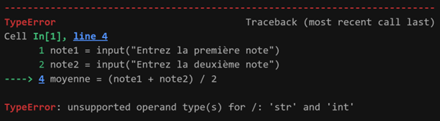

+++
chapter = true
pre = "2."
title = " Variables, types, entrée utilisateur et fonctions prédéfinies"
weight = 102
+++

## Objectifs

* Créer des variables et afficher leurs types (`int`, `float`, `str`, `bool`).
* Demander une donnée à l'utilisateur, la convertir et l’afficher de manière claire et lisible.
* Utiliser diverses fonctions prédéfinies.
* Écrire des programmes simples en python.

---

{}
- **Faites les exercices** en vous aidant des notes de cours ci-dessous.
- Certains seront fait en classe à titre de démonstration.
- Les solutions seront disponibles à la fin de la semaine prochaine.
{}

# Exercices

## Fichier de départ à utiliser

1. Cliquez sur le lien pour télécharger le fichier.
[Bloc-notes de départ](https://python-a25.netlify.app/blocnotes/exercices_variables_entrees_fonctions.ipynb)
2. Enregistrez le fichier dans votre dossier **exercices** de la semaine en cours.
3. Ouvrez **Visual Studio Code**.
4. Dans VS Code, recherchez et ouvrez le fichier `exercices_variables_entrees_fonctions.ipynb`
5. Assurez-vous que le noyau Python (`Kernel`) soit sélectionné.
6. Vous pouvez commencer à faire les exercices.

## Exercice 1 : Distance parcourue

Un cycliste roule à une vitesse constante de 6,5 m/s pendant 12 minutes.

* Écris le programme pour calculer la distance parcourue.

**Résultat attendu**:
```
Le cycliste a parcouru 4680.0 mètres en 12 minutes.
```

## Exercice 2 : Conversion de température

Un thermomètre donne des relevés en Fahrenheit, mais vous devez les convertir en Celsius et Kelvin.

1. Utilisez une variable pour stocker une température en °C.
2. Convertissez cette température en °F et en K.
3. Affichez les trois valeurs avec des messages clairs.

**Formules** :
```math
$ °F = (°C × 9/5) + 32 $  <br> 
$ K = °C + 273.15 $
```

**Résultat attendu avec une température de 38C** :
```
Température en Celsius : 38C
Température en Fahrenheit : 100.4F
Température en Kelvin : 311.15K
```

## Exercice 3 : Calcul de concentration molaire

Un technicien prépare une solution en dissolvant une masse donnée de soluté dans un certain volume de solvant.
Écrire un programme qui calcule la concentration molaire (mol/L) selon la formule :
```math
$ C = n / V $ où  $ n = m / M $
```
Où
`C` : Concentration molaire
`n` : Nombre de mole de soluté
`V` : Volume de la solution

**Résultat attendu avec** :  
m = 10.0 	masse du soluté en grammes  
M = 58.5	masse molaire du soluté en g/mol (ex. NaCl)  
V = 0.25	volume de la solution en litres  

```
Concentration molaire : 0.682051282051282 mol/L
```

## Exercice 4 : Vitesse moyenne d’une réaction

Lors d’une expérience de cinétique chimique, on mesure la variation de la concentration d’un réactif au cours du temps.
Écrire un programme qui calcule la vitesse moyenne de disparition selon :

```math
$ v = \frac{\Delta [A]}{\Delta t} $
```

où `[A]` est la concentration du réactif, ${\Delta [A]}$ la différence entre la concentration finale et initiale et ${\Delta t}$ la variation du temps.

**Résultat attendu avec**:  \[Réactif A] passe de 0.80 mol/L à 0.20 mol/L en 120 secondes.

```
Vitesse moyenne = -0.005000 mol L⁻¹ s⁻¹
```
---

# Cours

## Variables et types de données de base

* Une variable est un nom qui **désigne une valeur** et un espace de stockage d'une valeur.

```python
prenom = "Alice"
age = 20
temperature = 25.8
```

### Bien nommer vos variables:

* Utiliser des **noms significatifs** (ex : `masse_corps`, `volume_solution`)
* Commencer par une **lettre** ou un **souligné (_)**, jamais par un chiffre.
* Éviter les mots réservés de Python (`if`, `for`, `print`, etc.).
* Utiliser des mots séparés par des soulignés (_).
* Utiliser des mots commençants par une lettre majuscule, sauf le premier mot (ex : `masseCorps`, `volumeSolution`).

Mauvais exemples :

```python
1age = 20       # commence par un chiffre → erreur
print = 8       # print est un mot réservé → erreur
```

### Types de base des données

| Type    | Exemple          | Description                     |
| ------- | ---------------- | ------------------------------- |
| `int`   | `5`, `-3`        | Nombre entier                   |
| `float` | `3.14`, `-0.5`   | Nombre à virgule flottante      |
| `str`   | `"Bonjour"` ou `'Bonjour'`    | Chaîne de caractères (`string`)           |
| `bool`  | `True`, `False`  | Valeur booléenne (vrai ou faux) |

{}
Pour les données de type à virgule flottante, on utilise le point (`.`) à la place d'une virgule (`,`).
{}


### Conversion de type

* Parfois on a besoin de modifier le type d'une données avant de l'utiliser. Pour ce faire on utilise des fonctions:
    * `int()` pour convertir en nombre entier
    * `float()` pour convertir en nombre décimal
    * `str()` pour convertir en chaine de caractères

**Exemples**:
```python
age = int("18")        # str vers int
temp = float("22.5")   # str vers float
taxes = str("14.978")   # float vers str
```

Si on veut connaitre le type d'une donnée on utilise `type()`

```python
type("Bonjour")  # str
type(3.14)       # float
type(42)         # int
```

## Lecture de données au clavier avec `input()`

Souvent, les données d'un programme proviennent de son utilisateur qui les tape au clavier.
La **fonction** `input()` permet de stocker la données dans une variable.

```python
nom = input("Quel est ton nom ? ")
age = int(input("Quel est ton âge ? "))
```

Les données entrées par `input()` sont **toujours** des chaînes (`str`). Il faut donc les **convertir** pour faire des calculs :

**Exemple d'erreur en cas d'oubli de convertir**

```python
note1 = input("Entrez la première note")
note2 = input("Entrez la deuxième note")

moyenne = (note1 + note2) / 2	==> ERREUR
```



{}
L'erreur est causée par le fait que la fonction `input()`, transforme toutes les saisies au clavier en **chaine de caractères (`str`)**.
Si on tape au clavier **95** et **98**, pour Python c'est **"95" + "98"**, ce qui n'est pas une opération valide. C'est comme essayer de faire "Bonjour" + "Salut".
{}

> La **conversion des deux notes en entier**, fait en sorte que Python arrive à faire le calcul sans problème.


## Fonctions prédéfinies

### Qu’est-ce qu’une fonction ?

* Une fonction est un **bloc de code réutilisable**. On peut lui donner des **paramètres** (valeurs en entrée) et elle peut renvoyer un **résultat** ou simplement l'afficher. 
* Si une fonction renvoie un résultat, il devra être **stocké dans une variable** pour être utilisé ailleurs dans le code ou on pourra **utiliser la fonction** directement à l'endroit où le résultat est requis.

{}
Une fonction est comme une recette qu'on peut réutiliser autant de fois que l'on veut:
- Les ingrédients : les paramètres.
- La préparation : le corps de la fonction.
- Le résultat final : la valeur retournée ou affichée.
Utiliser une fonction, c’est suivre la recette avec des ingrédients précis.
{}

### Exemples de fonctions prédéfinies

| Fonction  | Utilité                                 | Exemple                         |
| --------- | --------------------------------------- | ------------------------------- |
| `print()` | Afficher un message                     | `print("Bonjour !")`            |
| `type()`  | Afficher le type d’une variable         | `type(3.5)` → `<class 'float'>` |
| `input()` | Demander une donnée à l’utilisateur     | `nom = input("Votre nom :")`    |
| `int()`   | Convertir en entier                     | `val = int("5")`                |
| `float()` | Convertir en nombre décimal             | `val = float("3.14")`           |
| `round()` | Arrondir un nombre                      | `round(2.718, 2)` → `2.72`      |
| `len()`   | Compter les éléments d’une chaîne/liste | `len("atomes")` → `6`           |

> On utilise une fonction en l'**appelant**. On l'appelle en écrivant son nom suivi de parenthèses.

### Quelques fonctions du module `math`

Pour accéder à des fonctions mathématiques, on utilise le **module `math`**.

```python
import math
```

| Fonction         | Description        | Exemple                         |
| ---------------- | ------------------ | ------------------------------- |
| `math.sqrt(x)`   | Racine carrée      | `math.sqrt(16)` → `4.0`         |
| `math.pow(x, y)` | Puissance          | `math.pow(2, 3)` → `8.0`        |
| `math.sin(x)`    | Sinus (en radians) | `math.sin(math.pi / 2)` → `1.0` |
| `math.log(x)`    | Logarithme naturel | `math.log(10)`                  |

La constante PI est aussi disponible via le module math :
| Constante      | Description        | Exemple       |               
| -------------- | ------------------ | ------------- |
| `math.pi`        | La constante π     | `math.pi` → `3.14159...`        |


## Affichage des données avec *print* et les *f-string*

* La fonction  `print()` permet d'afficher des résultats.
* On peut aussi utiliser `print()` pour ajouter un saut de ligne.

* Quand on veut afficher une phrase contenant des **valeurs numériques ou des variables**, c'est préférable d'utiliser des **f-strings** (ou **chaînes formatées**) pour aller plus vite et rendre le code plus clair.

**Exemple** :

```python
nom = "Sophie"
age = 18
print(f"{nom} a {age} ans.")
```

```plaintext
Résultat : Sophie a 18 ans.
```

* Le `f` devant les guillemets indique qu’on veut insérer des **valeurs de variables** directement dans le texte. On place les **variables** entre **accolades** `{}`.

* Mais parfois, on veut afficher **un nombre arrondi**, **aligné**, ou **avec des zéros**. C’est là qu’on utilise les **modificateurs de format** juste après la variable, entre `:` et `}`.


### Les modificateurs de format numérique

| Objectif                                | Syntaxe           | 
| --------------------------------------- | ----------------- | 
| Afficher **2 décimales**                | `{valeur:.2f}`    |
| Afficher **6 caractères dont 2 décimales, avec des zéros devant**   | `{valeur:06.2f}`  |
| Afficher **10 caractères dont 2 décimales** et **aligner à droite** | `{valeur:>10.2f}` |
| **Aligner à gauche** sur 10 caractères dont **2 décimales** | `{valeur:<10.2f}` |
| **Afficher un pourcentage** avec 1 décimale      | `{valeur:.1%}`    |
| Affichage **centré** sur 10 caractères et **2 décimales** | `{valeur:^10.2}`    |
| Format **scientifique** (notation exponentielle) | `{valeur:.2e}`    |

**Explication** :
* `.2f` → **f** pour "float", **2** pour eux décimales
* `10.2f` → total de 10 caractères, dont 2 après la virgule
* `<`, `>`, `^` → alignement (gauche, droite, centré)

**Exemples** :
```python
montant = 134.8678
taux = 15
print(f"Montant : {montant:.2f} $")        # → Montant : 134.87 $
print(f"Montant : {montant:08.2f} $")      # → Montant :   134.87 $
print(f"Montant : {montant:>10.2f} $")     # → Montant :     134.87 $
print(f"Montant : {montant:<10.2f} $")     # → Montant : 134.87     $ 
print(f"Taux    : {taux:.2%}")             # → Taux : 15.00 %
print(f"Montant : {montant:^10.2f} $")     # → Montant :   134.87   $
print(f"Montant : {montant:.2e} $")        # → Montant : 1.35e+02 $
```

On peut aussi utiliser `print()` pour afficher plusieurs choses à la fois, en les séparant avec des **virgules** :

```python
prenom = "Nathalie"
age = 25
print("Prénom :", prenom, "Âge :", age)
```
```python
Prénom: Nathalie Âge : 25
```

## Documentation du code (les commentaires)

On écrit des **commentaires** pour expliquer le code. Python ignore tout ce qui suit `#` sur une ligne.

**Exemples :**
```python
# Calcul de l'aire d'un cercle
rayon = 3
aire = 3.14 * rayon ** 2  # formule de l’aire
```

## Opérateurs arithmétiques

| Opérateur | Signification                   | Exemple  | Résultat |
| --------- | ------------------------------- | -------- | -------- |
| `+`       | Addition                        | `3 + 2`  | `5`      |
| `-`       | Soustraction                    | `7 - 4`  | `3`      |
| `*`       | Multiplication                  | `5 * 2`  | `10`     |
| `/`       | **Division** (résultat décimal) | `6 / 2`  | `3.0`    |
| `//`      | **Division entière**            | `7 // 2` | `3`      |
| `%`       | **Modulo** (reste)              | `7 % 2`  | `1`      |
| `**`      | Puissance                       | `3 ** 2` | `9`      |

{}
Les différents résultats pour les trois types de division (en **gras** dans le tableau).
* [Division et division entière](http://w3.uqo.ca/adavoust/cours/expressions1.html#Division-et-division-enti%C3%A8re)   
* [Division entière et modulo](http://w3.uqo.ca/adavoust/cours/expressions1.html#Division-enti%C3%A8re-et-modulo)  
{}

## Expressions et priorité des opérateurs

Une **expression** est une combinaison de variables, de nombres et d'opérateurs.

### Priorité (ordre d’exécution) des opérateurs :

1. `()` : parenthèses
2. `**` : puissance
3. `*`, `/`, `//`, `%` : multiplication et division
4. `+`, `-` : addition et soustraction

**Exemple :**

```python
resultat = 3 + 4 * 2       # donne 11, pas 14 !
resultat = (3 + 4) * 2     # donne 14 grâce aux ()
```

{}
* Une variable garde une **valeur**.
* On utilise les **bonnes pratiques** pour nommer nos variables.
* Les **commentaires** servent à documenter le code.
* Les **opérateurs arithmétiques** permettent de faire des calculs.
* Comme en mathématiques, l’ordre des opérations est **important** en Python.
* `print()` permet d'afficher une réponse, seule ou avec du texte.
* De préférence, utiliser des `f-string`.
   * Le `f` vient **juste avant** les guillemets.
   * On peut insérer n'importe quelle **variable** ou **expression** dans `{}`.
{}

---

# Atelier

[Bloc-notes de départ](https://python-a25.netlify.app/blocnotes/atelier_variables_entrees_fonctions.ipynb)

## Exercice #1 - Expérience en chimie

Un bécher contient 400 mL de solution. La solution s’évapore à raison de 25 mL/min.
La situation est linéaire : on commence à 400 mL, et on perd 25 mL chaque minute.
Donc la fonction est :
```math
$$
q(t) = 400 - 25t
$$
```
où :
* $t$ est le temps en minutes,
* $q(t)$ est la quantité de solution restante (en mL) après $t$ minutes.

On souhaite trouver la quantité de solution qu'il restera après 10 min 15 s

**NB**:
* Identifier les variables, les constantes et les formules nécessaires  


**Résultat attendu** :

```
Quantité restante après 10.25 minutes : 143.75 mL.
```

## Exercice #2 - Calcul de la force gravitationnelle

Écrire un programme qui:

1. Demande à l’utilisateur d’entrer le nom de l’objet (chaîne de caractères).
2. Demande à l’utilisateur d’entrer la masse de l’objet (nombre décimal, en kg).
3. Défini la constante d’accélération gravitationnelle (9,8 m/s²).
4. Calcule la force en utilisant la formule : `force = masse * accélération`
5. Affiche la force avec une phrase claire, incluant le nom de l’objet et l’unité en N (Newton).

Testez le programme avec ces deux cas:  

**Cas #1.** Objet: balle et masse: 2,5 Kg

**Sortie attendue** :
```
La force de la balle de 2.5 Kg est de 24.50 N.
```

**Cas #2.** Objet: voiture et masse: 1000,0 Kg

**Sortie attendue** :
```
La force de la voiture de 1000.0 Kg est de 9800.00 N.
```

---

## Exercice #3 – Calcul d’intérêts simple et composé

Un investisseur place **100 \$**. On souhaite comparer deux situations :

1. **Intérêt simple** :

   * Taux : **3,2 % par an**
   * Durée : **10 ans**
   * Formule :

     $$
     V_{\text{simple}} = M \times \big(1 + t \times n\big)
     $$

     où

     * $M$ = montant initial,
     * $t$ = taux d’intérêt simple (par an),
     * $n$ = durée (en années).

2. **Intérêt composé** :

   * Taux : **1,6 % par semestre** (deux fois par an, donc équivalent à 3,2 % par an)
   * Durée : **10 ans**
   * Nombre de périodes :

     $$
     p = 2 \times n
     $$
   * Formule :

     $$
     V_{\text{composé}} = M \times \big(1 + t_c\big)^p
     $$

     où

     * $M$ = montant initial,
     * $t_c$ = taux d’intérêt composé par période,
     * $p$ = nombre total de périodes.

3. **Écart relatif (en %)** entre les deux montants :

   $$
   \text{Écart} = \frac{V_{\text{composé}} - V_{\text{simple}}}{V_{\text{simple}}} \times 100
   $$

**Résultats attendus** :

* Valeur avec intérêt simple : **132,00 \$**
* Valeur avec intérêt composé : **134,87 \$**
* Écart relatif : **2,17 %**

---


## Exercice #4 - Calcul de la hauteur maximale

Vous voulez aider un·e physicien·ne à calculer la **hauteur maximale** atteinte par un objet lancé verticalement vers le haut avec une certaine vitesse initiale. 
* Écrire un programme qui demande la **vitesse initiale** au lancement, puis calcule la hauteur maximale atteinte par l’objet (en négligeant la résistance de l’air).

La formule utilisée est :
```math
$$
h_{\text{max}} = \frac{v^2}{2g}
$$
```

avec :

```math
$v$ : vitesse initiale (en m/s) <br>  
$g$ : accélération gravitationnelle = 9.81 m/s²  <br>
$h_{\text{max}}$ : hauteur maximale (en m)  
```

## Exercice 5 - Calcul de probabilité géométrique (Facultatif)

On choisit un point au hasard dans ce rectangle. Calcule la probabilité que ce point se situe dans la région grise, c’est-à-dire en dehors des cercles.


* Un rectangle contenant **6 cercles isométriques** (même taille),
* Ils sont organisés en **2 rangées** de **3 cercles**,
* La **hauteur du rectangle est 10 cm**, ce qui correspond à **deux diamètres** de cercles (1 par rangée).

**NB**:
* Identifier les variables, les constantes et les formules nécessaires  


**Résultat attendu** :

```
Probabilité qu’un point tombe dans la région grise : 0.2119 (soit 21.19 %)
```


---

## À faire avant le prochain cours

1. Lire la prochaine leçon : [3. Structures conditionnelles et algorithmes simples](../semaine3/)
2. Faire les exercices de la [prochaine leçon :](../semaine3/#exercices)
