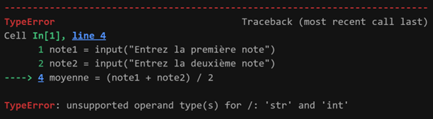

+++
chapter = true
pre = "<b>3.</b>"
title = " Saisie au clavier, fonctions et débogage"
weight = 103
+++

## Objectifs 

À la fin de la leçon, vous devrez être en mesure de :

* Gérer les entrées (**saisies au clavier**) d'un programme Python.
* Utiliser des fonctions **prédéfinies**.
* Définir ses propres fonctions avec `def` (paramètres, `return`, portée locale)
* Documenter les fonctions personnalisées (`docstring`)
* Comprendre les messages d'erreurs et à apprendre à déboguer un programme.

---

## Lecture et conversion de données

### Lire une donnée au clavier

La fonction `input()` permet de lire une donnée saisie au clavier :

```python
nom = input("Quel est ton nom ? ")
```

### Convertir les données

Les données entrées par `input()` sont **toujours** des chaînes (`str`). Il faut donc les **convertir** pour faire des calculs :

**Exemple d'erreur en cas d'oubli de convertir**

```python
note1 = input("Entrez la première note")
note2 = input("Entrez la deuxième note")

moyenne = (note1 + note2) / 2	==> ERREUR
```



{}
L'erreur est causée par le fait que la fonction `input()`, transforme toutes les saisies au clavier en **chaine de caractères (`str`)**.
Si on tape au clavier **95** et **98**, pour Python c'est **"95" + "98"**, ce qui n'est pas une opération valide. C'est comme essayer de faire "Bonjour" + "Salut".
{}

#### Comment convertir des données en entier (*int*) ou en nombre flottant (*float*)

| Fonction  | Conversion vers… | Exemple                |
| --------- | ---------------- | ---------------------- |
| `int()`   | entier           | `int("5") → 5`         |
| `float()` | décimal          | `float("3.14") → 3.14` |

```python
note1 = input("Entrez la première note")
note1 = int(note1)	# conversion en entier
note2 = input("Entrez la deuxième note")
note2 = int(note2)	# conversion en entier

moyenne = (note1 + note2) / 2

print(f"La moyenne des deux notes {note1} et {note2} est: {moyenne}")
```
> La **conversion des deux notes en entier**, fait en sorte que Python arrive à faire le calcul sans problème.


## Qu’est-ce qu’une fonction ?

* Une fonction est un **bloc de code réutilisable**. On peut lui donner des **paramètres** (valeurs en entrée) et elle peut renvoyer un **résultat** ou simplement l'afficher. 
* Si une fonction renvoie un résultat, il devra être **stocké dans une variable** pour être utilisé ailleurs dans le code ou on pourra **utiliser la fonction** directement à l'endroit où le résultat est requis.

{}
Une fonction est comme une recette qu'on peut réutiliser autant de fois que l'on veut:
- Les ingrédients : les paramètres.
- La préparation : le corps de la fonction.
- Le résultat final : la valeur retournée ou affichée.
Utiliser une fonction, c’est suivre la recette avec des ingrédients précis.
{}

### Utilisation de fonctions prédéfinies

Python offre plein de **fonctions toutes prêtes** (*prédéfinies*).

**Exemples de fonctions prédéfinies** :

| Fonction  | Utilité                                 | Exemple                         |
| --------- | --------------------------------------- | ------------------------------- |
| `print()` | Afficher un message                     | `print("Bonjour !")`            |
| `type()`  | Afficher le type d’une variable         | `type(3.5)` → `<class 'float'>` |
| `input()` | Demander une donnée à l’utilisateur     | `nom = input("Votre nom :")`    |
| `int()`   | Convertir en entier                     | `val = int("5")`                |
| `float()` | Convertir en nombre décimal             | `val = float("3.14")`           |
| `round()` | Arrondir un nombre                      | `round(2.718, 2)` → `2.72`      |
| `len()`   | Compter les éléments d’une chaîne/liste | `len("atomes")` → `6`           |

> On utilise une fonction en l'**appelant**. On l'appelle en écrivant son nom suivi de parenthèses.

### Quelques fonctions du module `math`

Pour accéder à des fonctions mathématiques plus avancées, on utilise le **module `math`**.

```python
import math
```

| Fonction         | Description        | Exemple                         |
| ---------------- | ------------------ | ------------------------------- |
| `math.sqrt(x)`   | Racine carrée      | `math.sqrt(16)` → `4.0`         |
| `math.pow(x, y)` | Puissance          | `math.pow(2, 3)` → `8.0`        |
| `math.sin(x)`    | Sinus (en radians) | `math.sin(math.pi / 2)` → `1.0` |
| `math.log(x)`    | Logarithme naturel | `math.log(10)`                  |

La constante PI est aussi disponible via le module math :
| Constante      | Description        | Exemple       |               
| -------------- | ------------------ | ------------- |
| `math.pi`        | La constante π     | `math.pi` → `3.14159...`        |

>> Pause 5 minutes


## Création de fonction avec `def`
 
> Une fonction peut:
   > 1. Afficher un résultat (ex: `print()`)
   > 2. Retourner un résultat (ex: `input()`)


### Comment créer et utiliser une fonction ?

1. On utilise le mot clé `def`.
2. Suivi du nom de la fonction.
3. Suivi de parenthèses `()`.
4. Suivi de deux-points `:`.
5. Les instructions de la fonction sont sur les lignes d'en dessous, décalées. Ce décalage, permet à Python de reconnaitre le code qui appartient à la fonction et qui sera exécuté lors de son utilisation. 
L'absence de ce décalage (**indentation**) provoque l'erreur ***IndentationError***.

```python
IndentationError: expected an indented block after function definition on line X
```

{}
* Les règles de **nomenclature des variables**, s'appliquent aussi aux noms de fonctions.
* Entre les parenthèses, on peut indiquer des **paramètres ou pas**, mais les **parenthèses sont obligatoires**.
{}

#### Syntaxes générales

**Une fonction qui affiche le résultat** :
```python
def nom_fonction(param1, param2): # <--- Les deux-points 
    instructions
    print(résultat) # <--- La fonction se termine ici
```

**Exemple** :

```python
# Définition de la fonction
def aire_rectangle(longueur, largeur):
    aire = longueur * largeur
    print(f"L'aire du rectangle de longueur {longueur} et de largeur {largeur} est {aire} cm^2") 
```

> Cette fonction reçoit deux valeurs (longueur et largeur du rectangle), calcule l’aire du rectangle et **affiche** l'aire.

**Une fonction qui retourne le résultat** :

```python
def nom_fonction(param1, param2):
    instructions
    return résultat # <---- La fonction se termine ici
```

**Exemple** :

```python
# Définition de la fonction
def aire_rectangle(longueur, largeur):
    aire = longueur * largeur
    return aire  
```

> Cette fonction reçoit deux valeurs (longueur et largeur du rectangle), calcule l’aire du rectangle et la **retourne**.

#### Le mot-clé `return`

* Il **renvoie un résultat** à l’endroit où la fonction a été utilisée (appelée).
* Dès que `return` est exécuté, la fonction **s’arrête**.


#### Appeler (utiliser) une fonction

**Utilisation de la fonction `aire_rectangle()` qui **affiche** l'aire**

```python
# Appel de la fonction
aire_rectangle(5, 2)
```
> Les valeurs utilisées entre les parenthèses seront utilisées par la fonction.
> Ici, 5 est la valeur pour la longueur et 2 celle de la largeur.

**Utilisation de la fonction `aire_rectangle()` qui **retourne** l'aire**

```python
surface = aire_rectangle(5, 2) # Appel de la fonction
print(f"L'aire du rectangle est : {surface}")
```
> Notez la différence: Ici, **il faut stocker le résultat de la fonction dans une variable**.

On aurait aussi pu faire:
```python
print(f"L'aire du rectangle est : {aire_rectangle(5, 2)}") # Appel de la fonction
```
>> Pause 5 minutes

### La portée locale des variables

Les **variables créées **à l'intérieur** d'une fonction** (ex: `aire`) **n’existent que dans la fonction**.

**Exemple** :

```python
def test():
    x = 10  <---- On peut utiliser x qu'à l'intérieur de la fonction.
    return x <---- Après cette ligne, x n'existe plus. 

print(test())  # OK, affiche 10
print(x)       # Erreur : x n'existe pas ici
```


## Documenter ses fonctions (*docstrings*)

Les ***docstrings*** sont des chaînes de caractères utilisées pour documenter les fonctions. Elles sont placées juste après la définition de la fonction.

**Format standard**
```python
def nom_fonction(param):
    """
    Description de la fonction.

    Paramètres:
    - param (type): Description.

    Retour:
    - type: Description.
    """
```

**Exemple** :
```python
def addition(a, b):
    """
    Calcule la somme de deux nombres.

    Paramètres:
    a (int, float): Le premier nombre.
    b (int, float): Le deuxième nombre.

    Retour:
    int, float: La somme des deux nombres.
    """
    return a + b
```

## Trouver facilement les sources des erreurs dans nos programmes (débogage)

**Déboguer**, c’est trouver les causes des erreurs dans le cod, afin de les corriger rapidement.

### Types d’erreurs fréquentes

* **Erreur de syntaxe** : La syntaxe de Python n'est pas respectée. Ex.: `print("Bonjour'`
* **Erreur d’exécution** : Le mauvais type de données est utilisé. Ex.: `valeur = int("abc")`
* **Erreur de logique** : Les instructions ne correspondent pas à la logique imposée par le problème. Ex.: `aire = longueur + largeur`
 

### Quelques habitudes à avoir pour déboguer

* Lire le message d’erreur affiché
* Ajouter des ***print()*** pour suivre les valeurs.
* Corriger les erreurs dans l'**ordre de leur apparition**, car 1 erreur, peut soit en cacher ou être la cause d'autres erreurs.
* Tester **une ligne à la fois**.
* Se poser la question : "Est-ce que le résultat est correct ?".
* Vérifier les types des données avec *type()*.


### Exemple de code présentant des erreurs

**Énoncé du problème**

Ce programme est censé calculer le temps nécessaire pour qu’un objet tombe d’une certaine hauteur `h` en chute libre (sans frottement), en utilisant la formule :

```math
$$
t = \sqrt{\frac{2h}{g}}
$$
où $g = 9.8 \, m/s^2$ est l’accélération gravitationnelle.
```
> Malheureusement, le programme contient des erreurs. Utilisez des `print()` pour comprendre ce qui ne fonctionne pas, puis corrigez le code.

**Code à déboguer**

```python
import math

def temps_chute(hauteur):
g = "9.8"
    t = math.sqrt(2 * hauteur / g)
    return t

h = input("Entrez la hauteur de chute en mètres: ")

temps = temps_chute(h)

print("Le temps de chute est {temps} secondes.")
```

---

{}

**Erreurs intégrées** :
1. Erreur d'indentation : définition de `g` n'est dans le corps de la fonction.
2. `g = "9.8"` : valeur gravitationnelle en chaîne de caractères → provoquera une erreur de type.
3. `input()` retourne une chaîne → doit être convertie en `float()`.
4. Il manque `f` dans le `print()` final.
5. Le type de la variable `hauteur` dans `temps_chute()` est incorrect (chaîne).

```python
import math

def temps_chute(hauteur):
    g = 9.8

    # Vérification du type de g
    print(type(g))

    t = math.sqrt(2 * hauteur / g)

    # vérification de la valeur de t
    print(f"Temps de chute calculé: {t}")

    return t 

h = float(input("Entrez la hauteur de chute en mètres: "))

# vérification de la valeur de h
print(f"Hauteur entrée: {h}")

temps = temps_chute(h)

print("Le temps de chute est {temps} secondes.")
```
{}

{}
* Python fourni des fonctions prédéfinies, prêtes à être utiliser (ex: les fonctions du module `math`)
* `input()` permet de lire une donnée (toujours une chaîne).
* Il faut convertir avec `int()` ou `float()` pour faire des calculs.
* `def` : sert à définir une fonction 
* ***nom_fonction(paramètres)*** : Les paramètres sont les variables représentant les données dont la fonction a besoin pour obtenir le résultat.                   
* `return` : Permet à la fonction de retourner un résultat (`resultat = fonction()` ou <br> `print(fonction())`)
* **Portée locale** : Signifie que les variables dans une fonction n’existent qu’à l’intérieur de .elle-ci|
* Pour **utiliser une fonction** prédéfinie ou personnalisé, il faut écrire sont nom, les parenthèses et les paramètres si elle en a.
{}

---

### Exercices à faire avant le cours

{}
Pour les exercices #2 à #5, utilisez (appelez) la fonction crée.
{}

## Exercice 1 : La loi d'Ohm

Un technicien de laboratoire vous demande d'écrire un programme Python pour calculer la tension (U) en volts selon la loi d’Ohm. Il voudrait pouvoir entrer la valeur de la résistance (en ohms) et la valeur du courant (en ampères), puis obtenir la tension.

```math
Loi d’Ohm : $ U = R × I $
```
Écrire un programme qui : 
1. Demande à l'utilisateur d'entrer la valeur de la résistance (en ohms).
2. Demande à l'utilisateur d'entrer la valeur du courant (en ampères).
3. Calcule et affiche la tension à l'aide d'une phrase.

**NB** : Ajoutez des explications en commentaire dans le code.

**Résultat attendu** :
```
Entrer la résistance en ohms : 10
Entrer le courant en ampères : 2
La tension est de 20.0 V
```

### Exercice 2 : Élément chimique

Écrire un programme qui :
* Demande à l'utilisateur d'entrer le nom d’un élément chimique.
* Affiche un message disant "L’élément choisi est \[nom]"

**Exemple d'affichage attendu (élément oxygène)** :
```python
Entrer le nom d'un élément chimique : oxygène
L’élément choisi est : oxygène
```

### Exercice 3 : Convertir Celsius en Kelvin

Crée une fonction nommée `convertir_C_en_K` qui :
* prend une température en °C en paramètre
* retourne la température en Kelvin (formule : K = C + 273.15)

**Exemple d'affichage attendu (30°C)** :
```python
Une température de 30°C équivaut à 303.15 K.
```

### Exercice 4 : Calculer une énergie cinétique

Créez une fonction `energie_cinetique(m, v)` qui calcule et retourne la valeur de l'énergie cinétique d'un objet en joules:

```math
$E_c = \frac{1}{2} \cdot m \cdot v^2$
```
où
* m  : La masse de l'objet en kilogrammes.
* v  : La vitesse de l'objet en mètres par seconde.

**Exemple d'affichage attendu avec `masse=2.0 kg` et `vitesse=3.0 m/s`** :
```python
L'énergie cinétique de l'objet est de 9.0 joules.
```

### Exercice 5 : Aire d'un cercle

Écrire une fonction `aire_cercle()` qui :
* Demande à l'utilisateur d'entrer le rayon du cercle (en cm).
* Calcule l'aire du cercle (utilisez le **module math** pour PI et le rayon².)
* Affiche l'aire du cercle, arrondie à 2 décimales (utilisez la fonction `round`).

**Exemple d'affichage attendu (rayon de 5 cm)** :
```python
Aire du cercle de rayon 5 cm : 78.54 cm²
```

### Exercice 6 : Vérifier la portée locale

Crée une fonction `tester_variable()` qui crée une variable `prenom = "votre prénom` et l’affiche dans la fonction avec un `print`.
Essaye ensuite d’afficher la valeur de `prenom` **à l’extérieur de la fonction**.

**Exemple d'affichage attendu** :
```python
NameError                                 Traceback (most recent call last)
Cell In[16], line 6
      3     print(f"Dans la fonction tu t'appelles : {prenom}")
      5 tester_variable()
----> 6 print(f"À l'exterieur de la fonction tu t'appelles : {prenom}") 

NameError: name 'prenom' is not defined
```

### Exercice 7 : Trouvez les erreurs et corrigez les

> Ce programme est censé calculer la surface d’un cône droit à partir du rayon et de la hauteur entrés par l’utilisateur. La formule utilisée est :
```math
$$
\text{Surface} = \pi \cdot r \cdot (r + \sqrt{r^2 + h^2})
$$
```
> Toutefois, des erreurs se sont glissées dans le programme. Utilisez des instructions `print()` pour comprendre les erreurs, puis corrigez-les une à une et exécutez le code après chaque correction avant de passer à l'erreur suivante.

**Code à déboguer et corriger** :

```python
def surface_cone(rayon, hauteur):
    aire_base = math.pi * rayon ** 2
    aire_lateral = math.pi * rayon * math.sqrt(rayon**2 + hauteur)
    surface = aire_base + aire_latérale
    return surface

r = input("Entrez le rayon du cône: ")
h = input("Entrez la hauteur du cône: ")

resultat = surface_cone(r, h)

print("La surface totale du cône est de {resultat} cm²")
```

---

## À faire avant le prochain cours

> **RAPPEL**: Semaine prochaine c'est le **premier examen** (20%)

1. Lire la matière sur [Décider avec if, elif, else et les opérateurs](../semaine5/)
2. Faire les [exercices se trouvant à la fin de la leçon 5](../semaine5/#exercices-à-faire-avant-le-cours)